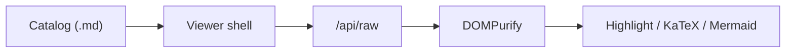

# Markdown preview sample

Open this file in Mino (`go run ./cmd/mino ./example`) to exercise GFM, highlight, KaTeX, Mermaid, and HTML sanitization.

## Outline demo

### Nested heading

This subsection exists so the right-side **On this page** outline can list `h1`–`h3` and exercise scroll spy.

## GFM table

| Feature | Status |
| --- | --- |
| Tree + search | Indexed as `.md` |
| Preview | Sanitized viewer iframe |
| Companion images | Not served |

## Task list

- [x] Catalog `.md` next to HTML apps
- [x] Render GFM in the iframe
- [ ] Optional: add your own notes

## Fenced JavaScript

```js
const greeting = "hello from a fence";
console.log(greeting);
// Dollars inside a fence stay literal: $E=mc^2$ and $5 + $10
```

## Math

Inline: $E=mc^2$

Standalone display math:

$$
\int_0^1 x\,dx
$$

Line-broken `\[` / `\]` is also display math:

\[
\sum_{n=1}^{N} n = \frac{N(N+1)}{2}
\]

A single-line `\[ E = mc^2 \]` is **not** treated as display math. Academic citations such as \[1\] stay literal text.

## Mermaid

Each diagram has Code / Split / Preview controls (default Preview). In Preview, use the toolbar or wheel+drag to zoom, and Fullscreen for a larger overlay.

A valid flowchart should render in the preview:



A broken diagram (for example `flowchart` with invalid syntax) should show a per-block error and leave other diagrams on the page intact.

## Sanitizer demo

The following raw HTML must not execute. You should **not** see an `alert` dialog:

<script>alert("xss")</script>
